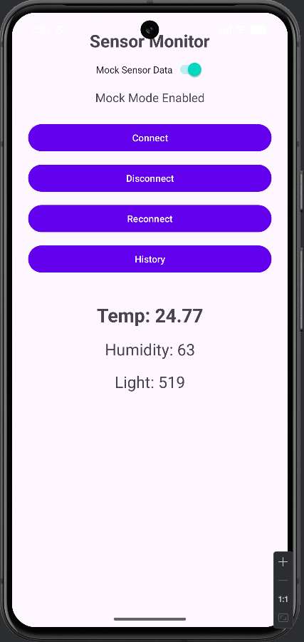
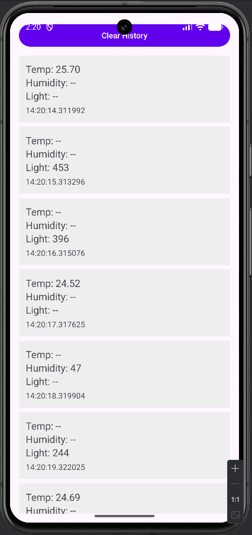
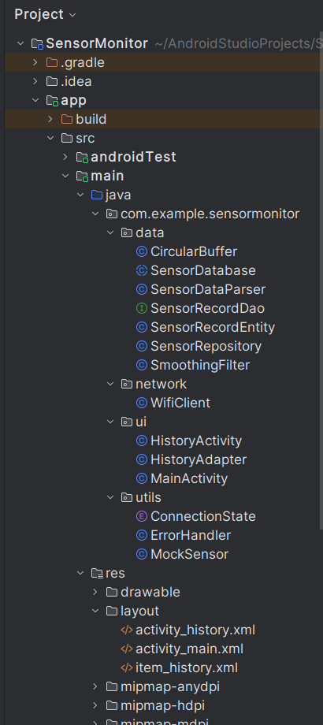

# Sensor Monitor Artifact

## Overview

The artifact I selected for my capstone is the mobile application I originally built in CS-360. It started as a simple weight-tracking app with all the logic packed into a single activity and very little structure. Over the course of this project, I transformed that basic assignment into a fully redesigned WiFi-based sensor monitor that reads temperature, humidity, and light values from an external device. This artifact has gone through three major enhancements, software engineering, algorithms and data structures, and databases, and each one reflects a different part of my growth in the Computer Science program. The final version of the app is far more modular, maintainable, and realistic than the original project, and it aligns much better with the type of work I want to do in embedded systems and IoT.

I chose this artifact because it represents the direction I want to take my career. Working with sensors, real-time data, and embedded systems is something I’m genuinely interested in, and this project gave me the chance to show those skills in a meaningful way. The original CS-360 app wasn’t something I would have put in a portfolio, but enhancing it across all three categories let me rebuild it into a project that actually demonstrates my abilities. It also gave me the opportunity to take an existing codebase, identify its weaknesses, and redesign it into something more professional. That process alone taught me a lot about how real software evolves over time.

The first enhancement focused on software engineering and design. I reorganized the entire project into a cleaner architecture with separate packages for UI, networking, data parsing, and utilities. I redesigned the UI using ConstraintLayout, added support for multiple sensor types, and introduced a mock-sensor mode so the app could run without hardware. I also added proper documentation, connection-state handling, and a dedicated history screen using a RecyclerView. These changes improved the structure, readability, and maintainability of the app and showed that I can design modular features, handle asynchronous data, and build a multi-screen Android application that feels more like a real product.

The second enhancement focused on algorithms and data structures. Real sensor data is noisy and inconsistent, so I implemented a custom CircularBuffer to store the last 20 readings for each sensor and added a moving-average smoothing algorithm to stabilize the values. Every incoming reading is now parsed, added to the buffer, smoothed, and then displayed. This made the app feel much more reliable and professional, and it demonstrated that I can design and integrate data-processing techniques that improve the quality of the information the user sees. It also required me to think about trade-offs, like choosing a buffer size that balances responsiveness with stability.

The third enhancement focused on databases. The original app stored history in a temporary in-memory list that disappeared every time the app closed. To fix this, I replaced the entire history system with a full Room database. I created a SensorRecordEntity, SensorRecordDao, SensorDatabase singleton, and a SensorRepository to follow clean architecture principles. I updated MainActivity to save smoothed readings with timestamps and refactored HistoryActivity to load records directly from the database. I also added support for clearing the database through the existing UI. This enhancement turned the app into something persistent and production-ready, and it strengthened my understanding of data modeling and long-term storage.

Looking back at the entire enhancement process, I learned a lot about working with an existing codebase and improving it step by step. Each enhancement came with its own challenges, redesigning the UI so it worked across devices, making sure mock-sensor mode behaved like real hardware, integrating smoothing without slowing down the UI, and replacing the entire history system without breaking anything. I also had to think more about user experience, error handling, and how different parts of the app interact with each other. These enhancements helped me improve my engineering habits and made the final artifact something I’m confident showing to employers.

Across all three enhancements, I met the course outcomes I planned for. I demonstrated software engineering skills by restructuring the project and improving maintainability. I demonstrated algorithmic thinking by designing and integrating the circular buffer and smoothing filter. I demonstrated database skills by implementing a full persistence layer using Room. Together, these enhancements show that I can design, evaluate, and implement computing solutions that solve real problems and follow modern development practices. This artifact represents my growth throughout the Computer Science program. It started as a basic classroom assignment and evolved into a structured, multi-screen, data-driven application that reflects the kind of work I want to do professionally. Enhancing it across all three categories helped me apply what I’ve learned in software engineering, algorithms, databases, and general problem-solving. It also helped me build an ePortfolio piece that demonstrates my abilities in a clear and meaningful way.

## Screenshots

## Code and Resources

- [Original Project](original/)  
- [Enhanced Project](enhanced/)  
- [Enhancement Narratives](narratives/)  
- [Code Review Video](https://your-youtube-link-here)
